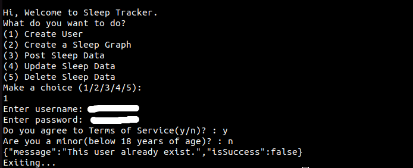
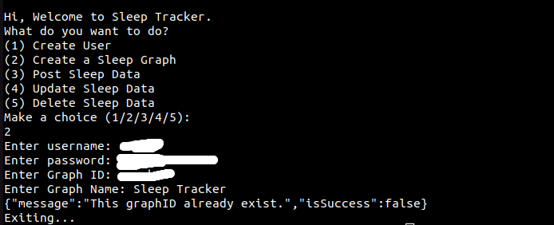
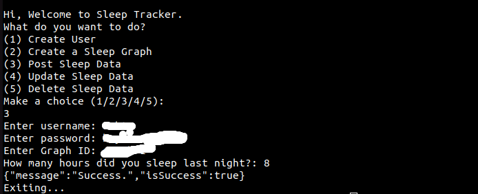
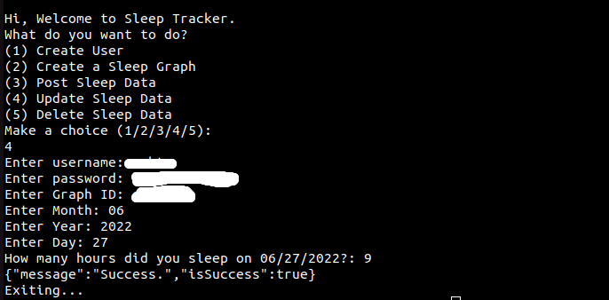
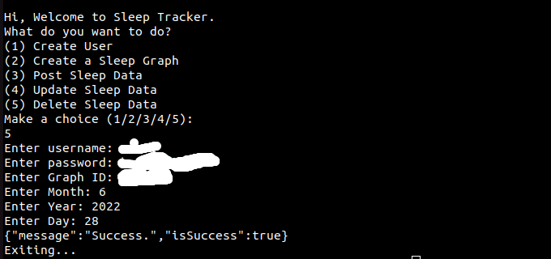
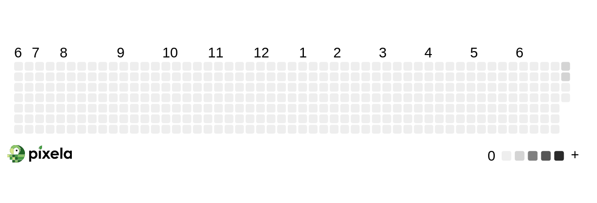

# Sleep-Tracker

### [twitter](https://twitter.com/achte_te)

## Description

A program that helps in tracking Sleep using Pixela API.

## Requirements

[Python](https://www.python.org/)

```sh
$ python3 --version
Python 3.9.12
```

[os](https://docs.python.org/3/library/os.html)

[datetime](https://docs.python.org/3/library/datetime.html)

[requests](https://pypi.org/project/requests/)

[Pixela API](https://pixe.la/)

## Install

```sh
$ git clone git@github.com:achte-2022/Sleep-Tracker.git
```

## Create a User



## Create a Graph



## Post Sleep Data



## Update Sleep Data



## Delete Sleep Data



## Progress
